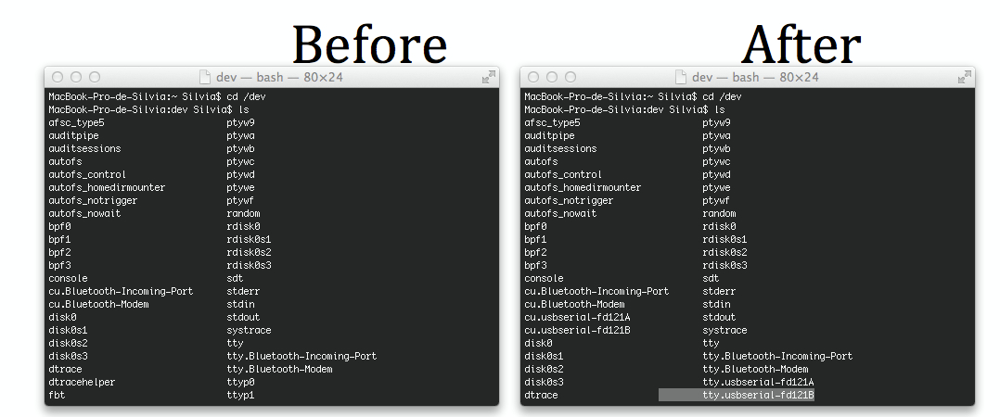
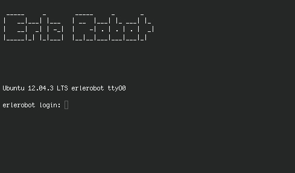

# Annex II: First steps with Erle
---

In this annex you can find an explanation of how to stablish a **serial connection** (using a mini-usb cable) and access *Erle* from your terinal.
Taking into account you should be able to follow the steps below without having any previus knowledge of Linux, very  basical explanations are given.

**You can find [here](https://www.youtube.com/watch?v=pzVlLXmCyP0) a video tutorial.**

First open a terminal and type:
```
cd /dev
```

With the command `cd` you position in the indicated directory, *dev directory * in this case.

With the command `ls` you get a list of the content of the directory.
Now you have to identficate *Erle*.
Please list before connecting the board and after connecting it.If everything is installed, two new devices (associated to erle) should appear associated in the list.



Please copy the *device* name.

Now type:
```
screen /dev/tty.usbserial-fd121B 115200
```
With this command line you are opening the specified device with the program screen.
If a screen with the erle prompt appears (like the one in the image):




Congratulations! You are into *Erle*.
If not, try the same with the other device name *tty.usbserial-fd121A*.
