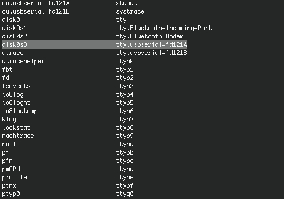
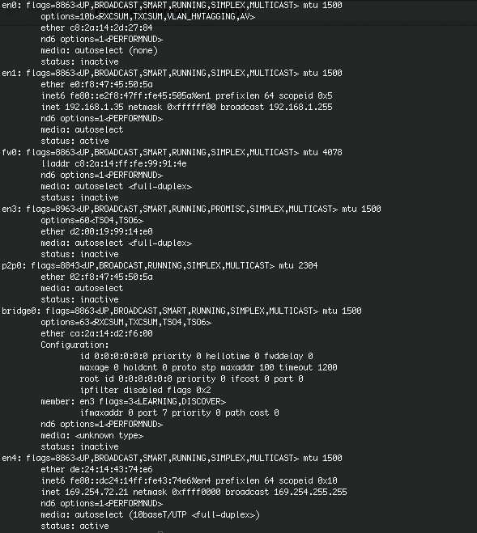
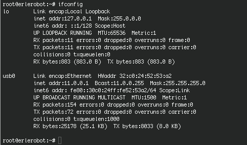
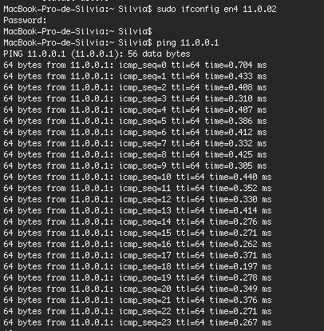
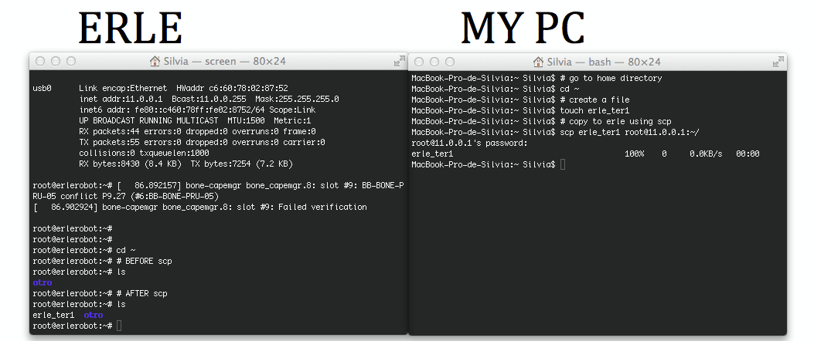

# Annex III: A new erle terminal
---

Sometimes, when you are working with *Erle* is more confortable having more than one terminal.
In this annex, you are going to learn how to **connect Erle and your computer** and how to launch as many erle-terminals as you wish.
Warning: Before working on what is explaned in the next paragraphs you should get a bit familiarized with Unix. We recommend you to read and practice till tutorial 6.

####II.1 Connecting with Erle

Connet Erle to your computer, using the USB wire.

Open a computer-terminal an type:
```
ls /dev
```
Whenever you connet a device to your computer, that device appears in this list.Here is erle:



This is only a verification of erle conectivity.

In the same terminal type:
```
ifconfig
```
You get this in the screen:




Usually *en0* and *en1* correspond to internet connection, *bridge* is usually matter of a virtual machine... We now care about *en4*, which is related to erle (you can check that  the status is active when erle is connected and that *en4* disappear when you disconect erle).

Now open a erle-terminal and type:
```
ifconfig
```
You get this:



There you can read in the *usb0* section the *erle conection id*:
```
inet addr:11.0.0.1
```
At this point we are going to make *en4* work in the same sub-network that erle does, by changing the *en4* id.
Type in your computer-terminal:
```
sudo ifconfig en4 11.0.0.2
```

You can check they (erle and your PC) are connected by tipping in your computer-terminal:
```
ping 11.0.0.1 (erle id)
```
The result should be something like this:



#### II.2 A new Erle-terminal

After doing the process above, you can launch as many shells as you want in a simply way. We are going to use `ssh` command in the computer-terminal, which allows you logging into a remote machine and executing commands on that machine.
The syntaxis is easy:

```
ssh usuario@id
```
In our case:
```
ssh root@11.0.0.1
```
####II.3 Transferring files from your computer to Erle

Once you have your computer and erle connected, for transferring a file from your pc to erle's home, type:
```
scp file root@11.0.0.1:~/
```
Remember:
- `~`menas your home directory.
- `cd ~`you go to your home directory.
- `echo $HOME`showns the path of your home directory.

Note: `scp` is similar to `cp`, is something like *a copy through the network*.
Let's see an example:


