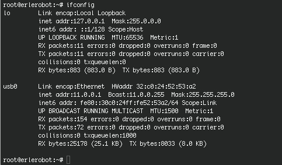
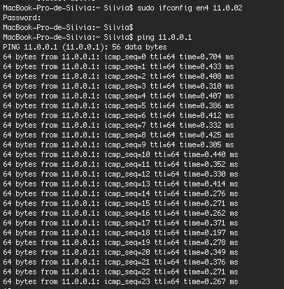

####II.1 Connecting with Erle

Connet Erle to your computer, using the USB wire.

Open a computer-terminal an type:
```
ls /dev
```
Whenever you connet a device to your computer, that device appears in this list.Here is erle:


This is only a verification of erle conectivity.

In the same terminal type:
```
ifconfig
```
You get this in the screen:


Usually *en0* and *en1* correspond to internet connection, *bridge* is usually matter of a virtual machine... We now care about *en4*, which is related to erle (you can check that  the status is active when erle is connected and that *en4* disappears when you disconect erle).

Now open a erle-terminal and type:
```
ifconfig
```
You get this:



There you can read in the *usb0* section the *erle conection id*:
```
inet addr:11.0.0.1
```
At this point we are going to make *en4* work in the same sub-network that erle does, by changing the *en4* id.
Type in your computer-terminal:
```
sudo ifconfig en4 11.0.0.2
```

You can check they (erle and your PC) are connected by tipping in your computer-terminal:
```
ping 11.0.0.1 (erle id)
```
The result should be something like this:


