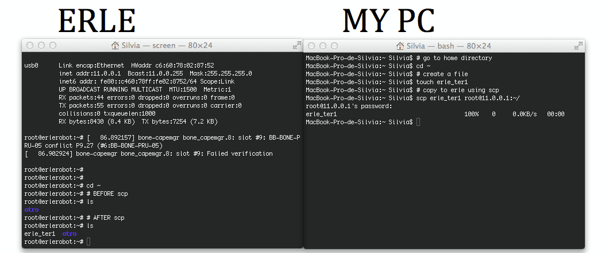

####II.3 Transferring files from your computer to Erle

Once you have your computer and erle connected, for transferring a file from your pc to erle's home, type:
```
scp file root@11.0.0.1:~/
```
Remember:
- `~`menas your home directory.
- `cd ~`you go to your home directory.
- `echo $HOME`showns the path of your home directory.

Note: `scp` is similar to `cp`, is something like *a copy through the network*.
Let's see an example:


