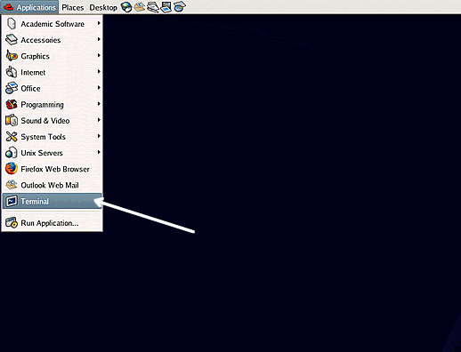
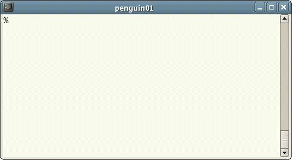

## Starting an UNIX terminal

To open an UNIX terminal window, click on the "Terminal" icon from Applications/Accessories menus.

An UNIX Terminal window will then appear with a % prompt, waiting for you to start entering commands.

