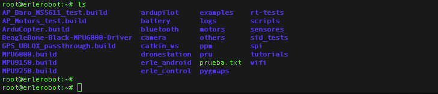
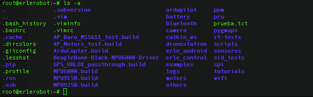

# Tutorial 1
---

**1.1 Listing files and directories**

`ls` (list)

When you first login, your current working directory is your home directory. Your home directory has the same name as your user-name, for example, *ee91ab*, and it is where your personal files and subdirectories are saved.

To find out what is in your home directory, type

`ls`

The `ls` command ( lowercase L and lowercase S ) lists the contents of your current working directory.


*working with erlerobot:*



There may be no files visible in your home directory, in which case, the UNIX prompt will be returned. Alternatively, there may already be some files inserted by the System Administrator when your account was created.

`ls` does not, in fact, cause all the files in your home directory to be listed, but only those ones whose name does not begin with a dot (.) Files beginning with a dot (.) are known as hidden files and usually contain important program configuration information. They are hidden because you should not change them unless you are very familiar with UNIX!!!

To list all files in your home directory including those whose names begin with a dot, type

` ls -a`

As you can see, ls -a lists files that are normally hidden.


*working with erlerobot:*



**1.2 Making Directories**

`mkdir `(make directory)

We will now make a subdirectory in your home directory to hold the files you will be creating and using in the course of this tutorial. To make a subdirectory called unixstuff in your current working directory type

` mkdir unixstuff`

To see the directory you have just created, type

`ls`


**1.3 Change to a different directory**

`cd `(change directory)

The command `cd` directory means change the current working directory to 'directory'. The current working directory may be thought of as the directory you are in, i.e. your current position in the file-system tree.

To change to the directory you have just made, type

```
cd unixstuff
```

Type `ls` to see the contents (which should be empty)

As an **exercise** you can try to make another directory inside the unixstuff directory called backups.

**1.4 The directories . and ..**

Still in the unixstuff directory, type

` ls -a`

As you can see, in the unixstuff directory (and in all other directories), there are two special directories called (.) and (..)

#####The current directory (.)

In UNIX, (.) means the current directory, so typing

` cd .`
means stay where you are (the unixstuff directory).

*Notice that there is a space between cd and the dot.*

This may not seem very useful at first, but using (.) as the name of the current directory will save a lot of typing, as we shall see later in the tutorial.

#####The parent directory (..)

(..) means the parent of the current directory, so typing

` cd ..`

will take you one directory up the hierarchy (back to your home directory). Try it now.

Note: typing cd with no argument always returns you to your home directory. This is very useful if you are lost in the file system.

**1.5 Pathnames**

`pwd `(print working directory)

Pathnames enable you to work out where you are in relation to the whole file-system. For example, to find out the absolute pathname of your home-directory, type cd to get back to your home-directory and then type

`pwd`

The full pathname will look something like this:

/home/its/ug1/ee51vn

which means that ee51vn (your home directory) is in the sub-directory ug1 (the group directory),which in turn is located in the its sub-directory, which is in the home sub-directory, which is in the top-level root directory called " / " .


**1.6 More about home directories and pathnames**

Understanding pathnames

First type `cd` to get back to your home-directory, then type

```
ls unixstuff
````

to list the conents of your unixstuff directory.

Now type

```
ls backups
```

You will get a message like this -

backups: No such file or directory

The reason is, backups is not in your current working directory. To use a command on a file (or directory) not in the current working directory (the directory you are currently in), you must either `cd` to the correct directory, or specify its full pathname. To list the contents of your backups directory, you must type

```
ls unixstuff/backups
```


#####~ (your home directory)

Home directories can also be referred to by the tilde `~ `character. It can be used to specify paths starting at your home directory. So typing

```
ls ~/unixstuff
```

will list the contents of your unixstuff directory, no matter where you currently are in the file system.

What do you think

`ls ~`

would list?  *List the files in your home directory*

**Summary**

| **Command** | **Meaning** |
|---------------|------------------|
| ls| list files in a directory|
| ls -a | list all files and directories|
| mkdir | make a directory|
| cd *directory* | change to the named directory|
| cd | change directory|
| cd ~ | change to the home directory|
| cd .. | change to th parent directory|
| pwd | display the path of the current directory|


