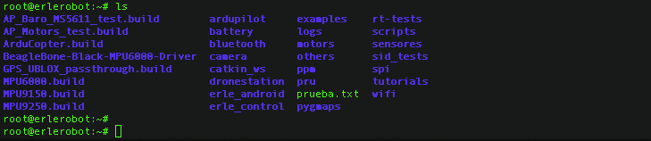
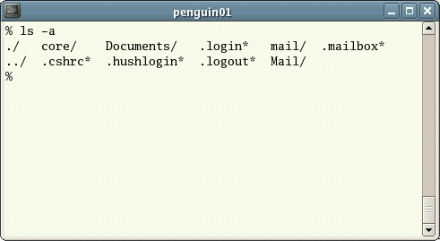
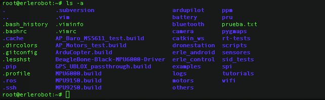

## Listing files and directories

`ls` (list)

When you first login, your current working directory is your home directory. Your home directory has the same name as your user-name, for example, *ee91ab*, and it is where your personal files and subdirectories are saved.

To find out what is in your home directory, type

```
ls
```

The `ls` command ( lowercase L and lowercase S ) lists the contents of your current working directory.


*working with erlerobot:*



There may be no files visible in your home directory, in which case, the UNIX prompt will be returned. Alternatively, there may already be some files inserted by the System Administrator when your account was created.

`ls` does not, in fact, cause all the files in your home directory to be listed, but only those ones whose name does not begin with a dot (.) Files beginning with a dot (.) are known as hidden files and usually contain important program configuration information. They are hidden because you should not change them unless you are very familiar with UNIX!!!

To list all files in your home directory including those whose names begin with a dot, type

```
ls -a
```


As you can see, ls -a lists files that are normally hidden.




*working with erlerobot:*


