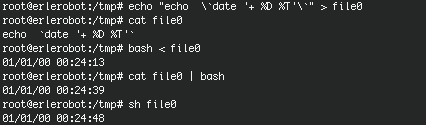
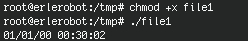

# Tutorial 10
---

####10.1 Introduction to shell script

A command file, batch file or **script** is usually a simple program, which is usually stored in a plain text file. The script is almost always interpreted, but not all interpreted program is considered a script. The common use of scripts is to perform various tasks such as combining components, interact with the operating system or with the user. The shells are usually the interpreters of such programs.

In the following paragraphs you are going to learns the very basics of shell script.

####10.2 Create and execute a script

We are going to create a little program that show us the date and the hour.
After going to `/tmp` directory and we use the command `banner` to write the date in big letters.Type:

```
cd /tmp
echo "echo `date '+%D %T'`" > file1
```
Show what contains the file using `cat`.
`cat file1` shows the date and the time when the file was created. We want that values but in the actual moment.

```
echo "echo \`date '+ %D %T'\`" > file1
cat file1
```

Now that the file is created we can execute it in differet ways.

```
bash < file1
```
```
cat file1 | bash
```
```
sh file0
```
*working with erlerobot:*




The most usual way of executing the scripts is like a command. For doing this you should first change the permissions:
```
chmod +x file1
```
Remember that the option `+x`is used for executable files.
For executing it type:
```
./ file1
```

The `./` will be necessary if the directory where the file is don't figure in the variable `$PATH`.

*working with erlerobot:*



####The internal proccess

The shell looks the first characters of the file(initial bytes). If it is a binary file the execution is done in the actual shell, if not a sub-shell is opened to run the proccess.
If you want to force the actual shell to run the program, type:
```
. ./file1
```

####10.3 Passing parameters to the shell


| **Parameter** | **Meaning** |
|---------------|---------------|
|$0|value of the executed command itself|
|$1 |value of the 1st parameter|
|$2,$3 ...|value of the 2nd, 3rd...parameter|
|$#|number of parameters|
|$*|value of all concatened parameters|

For understanding better the table above, let's do a simply exercise.
Create a file called *parameters*.And edit it(we recommend you using `vi parameters`) with the following content:
```
echo 'param. number=' $#
echo '$0=' $0
echo '$1=' $1
echo '$2=' $2
echo '$3=' $3
echo '$*=' $*
```
Now, change the permissions using
```
chmod +x parameters
```

And execute the script with different parameters:

```
./parameters (no parameters)
./parameters hello (one parameter)
./parameters pa1 pa2 pa3 (three parameters)
```
*working with erlerobot:*


