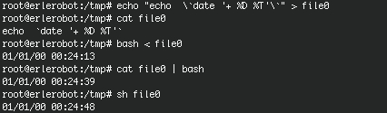
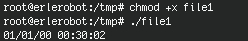

## Create and execute a script

We are going to create a little program that show us the date and the hour.
After going to `/tmp` directory and we use the command `banner` to write the date in big letters.Type:

```
cd /tmp
echo "echo `date '+%D %T'`" > file1
```
Show what contains the file using `cat`.
`cat file1` shows the date and the time when the file was created. We want that values but in the actual moment.

```
echo "echo \`date '+ %D %T'\`" > file1
cat file1
```

Now that the file is created we can execute it in differet ways.

```
bash < file1
```
```
cat file1 | bash
```
```
sh file0
```
*working with erlerobot:*




The most usual way of executing the scripts is like a command. For doing this you should first change the permissions:
```
chmod +x file1
```
Remember that the option `+x`is used for executable files.
For executing it type:
```
./ file1
```

The `./` will be necessary if the directory where the file is don't figure in the variable `$PATH`.

*working with erlerobot:*



####The internal proccess

The shell looks the first characters of the file(initial bytes). If it is a binary file the execution is done in the actual shell, if not a sub-shell is opened to run the proccess.
If you want to force the actual shell to run the program, type:
```
. ./file1
```
