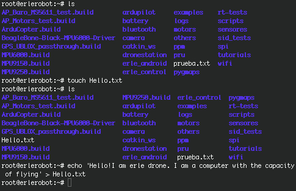

## Creating files


For the next explanations and exercises, we will assume that science.txt is a txt file with the following text on it:
>The Electronic Telegraph  Thursday 28 September 1995  Science
This summer the Royal Observatory at Herstmonceux
found new life as a science centre. Andro Linklater
celebrates a partial victory for the heritage

>THE SIGHT of a child's top spinning unsupported in mid-air should have been
surprising. Rotating there in space, it not only defied the rules of gravity,
it defied common sense, and at least three Fellows of the Royal Society gazed
at it in something close to wonder.

>But this was Fabricators' Week at the Herstmonceux Science Centre, with
exhibitors from science centres all over Europe arriving to demonstrate
prototypes of experiments they hoped to produce as hands-on displays - a tube
of rocket-propelled rubber balls, a solar-powered toy car, a model of planetary
movement. They had a much tougher audience in mind. Would it astonish a child?

Please ensure you create and save this file in a known place.

### Creating files (required for next steps)

If you want to create a file you should use the command `touch`. First go to the directory where you are working using`cd`. Then create the file by typing:
```
touch science.txt
```
Now that the file is created you can write on it by using the command `echo`. First let's see what does this command.Type:
```
echo 'Hello'
```
You can read on your shell screen the text you have written between the '', *Hello* in this case.

If you type
```
echo 'Hello' > science.txt
```
You will have written the text onto the file.
Note: the > is a redirection character, we will matter about the this characters in the *tutorial 3*.

*working with erlerobot:*




