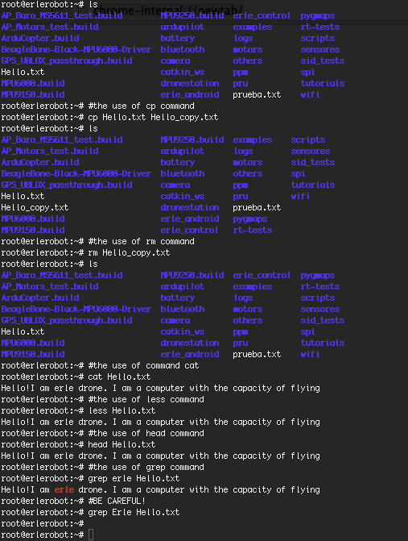

####2.6 Searching the contents of a file

Simple searching using `less`

Using `less`, you can search though a text file for a keyword (pattern). For example, to search through science.txt for the word 'science', type

```
 less science.txt
 ```

then, still in less, type a forward slash [/] followed by the word to search

```
/science
```

As you can see, less finds and highlights the keyword. Type [n] to search for the next occurrence of the word.


#####grep (don't ask why it is called grep)

`grep` is one of many standard UNIX utilities. It searches files for specified words or patterns. First clear the screen, then type

```
 grep science science.txt
 ```

As you can see, `grep` has printed out each line containg the word science (without capital letters)

Try typing

```
 grep Science science.txt
 ```

The `grep` command is case sensitive; it distinguishes between Science and science.

To ignore upper/lower case distinctions, use the -i option, i.e. type

```
 grep -i science science.txt
 ```

To search for a phrase or pattern, you must enclose it in single quotes (the apostrophe symbol). For example to search for spinning top, type

``` grep -i 'spinning top' science.txt```

Some of the other options of grep are:

-v display those lines that do NOT match
-n precede each matching line with the line number
-c print only the total count of matched lines
Try some of them and see the different results. Don't forget, you can use more than one option at a time. For example, the number of lines without the words science or Science is

```
 grep -ivc science science.txt
 ```


#####wc (word count)

A handy little utility is the `wc `command, short for word count. To do a word count on science.txt, type

```
 wc -w science.txt
 ```

To find out how many lines the file has, type

```
 wc -l science.txt
 ```

To finish, let's see some example of the commands.

 *working with erlerobot:*

 


