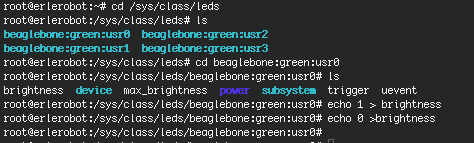

## Pipes

To see who is on the system with you, type

```
 who
 ```

One method to get a sorted list of names is to type,

```
 who > names.txt
 sort < names.txt
 ```

This is a bit slow and you have to remember to remove the temporary file called names when you have finished. What you really want to do is connect the output of the who command directly to the input of the sort command. This is exactly what pipes do. The symbol for a pipe is the vertical bar |

For example, typing

```
who | sort
```

will give the same result as above, but quicker and cleaner.

To find out how many users are logged on, type

```
 who | wc -l
 ```
As *exercise* using pipes, display all lines of list1 and list2 containing the letter 'p', and sort the result. (Remenber: `grep` command search for keyword-keyletter)
*Result:  cat list1 list2 | grep p | sort*

At this point you are ready to do something more practical with your erlerobot. In this [tutorial](http://erlerobot.github.io/erle_gitbook/en/Blink.html) explains how to blink a Led.It is a very good way of practicing some of the things you have learned till the moment.

*working with erlerobot: *


