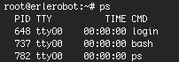

# Tutorial 5
---

####5.1 File system security (access rights)

In your unixstuff directory, type

```
 ls -l (l for long listing!)
 ```

You will see that you now get lots of details about the contents of your directory, similar to the example below:


Each file (and directory) has associated access rights, which may be found by typing ls -l. Also, ls -lg gives additional information as to which group owns the file (beng95 in the following example):
```
-rwxrw-r-- 1 ee51ab beng95 2450 Sept29 11:52 file1
```

In the left-hand column is a 10 symbol string consisting of the symbols d, r, w, x, -, and, occasionally, s or S. If d is present, it will be at the left hand end of the string, and indicates a directory: otherwise - will be the starting symbol of the string.

The 9 remaining symbols indicate the permissions, or access rights, and are taken as three groups of 3.

The left group of 3 gives the file permissions for the user that owns the file (or directory) (ee51ab in the above example);
the middle group gives the permissions for the group of people to whom the file (or directory) belongs (eebeng95 in the above example);
the rightmost group gives the permissions for all others.
The symbols r, w, etc., have slightly different meanings depending on whether they refer to a simple file or to a directory.

*working with erlerobot:*


#####Access rights on files.

r (or -), indicates read permission (or otherwise), that is, the presence or absence of permission to read and copy the file
w (or -), indicates write permission (or otherwise), that is, the permission (or otherwise) to change a file
x (or -), indicates execution permission (or otherwise), that is, the permission to execute a file, where appropriate

#####Access rights on directories.

r allows users to list files in the directory;
w means that users may delete files from the directory or move files into it;
x means the right to access files in the directory. This implies that you may read files in the directory provided you have read permission on the individual files.
So, in order to read a file, you must have execute permission on the directory containing that file, and hence on any directory containing that directory as a subdirectory, and so on, up the tree.

#####Some examples

-rwxrwxrwx

*a file that everyone can read, write and execute (and delete)*

-rw-------

*a file that only the owner can read and write - no-one else
can read or write and no-one has execution rights (e.g. your
mailbox file)*

####5.2 Changing access rights

`chmod` (changing a file mode)

Only the owner of a file can use `chmod` to change the permissions of a file. The options of `chmod` are as follows

|**Symbol**|**Meaning**|
|----------|-----------|
|u |user|
|g|group|
|o|other|
|a|all|
|r|read|
|w|write (and delete)|
|x|execute (and access directory)|
|+|add permission|
|-|take away permission|

For example; to remove,read ,write and execute permissions on the file biglist for the group and others, type

```
chmod go-rwx biglist
```

This will leave the other permissions unaffected.

To give read and write permissions on the file biglist to all,

```
 chmod a+rw biglist
 ```

As **exercise** try changing access permissions on the file science.txt and on the directory backups (Use ls -l to check that the permissions have changed).


####5.3 Processes and Jobs

A process is an executing program identified by a unique PID (process identifier). To see information about your processes, with their associated PID and status, type

```
ps
```


A process may be in the foreground, in the background, or be suspended. In general the shell does not return the UNIX prompt until the current process has finished executing.

Some processes take a long time to run and hold up the terminal. Backgrounding a long process has the effect that the UNIX prompt is returned immediately, and other tasks can be carried out while the original process continues executing.


*working with erlerobot:*




#####Running background processes

To background a process, type an & at the end of the command line. For example, the command sleep waits a given number of seconds before continuing. Type

```
 sleep 10
 ```

This will wait 10 seconds before returning the command prompt %. Until the command prompt is returned, you can do nothing except wait.

To run sleep in the background, type

```
sleep 10 &
```
```

[1] 6259
```

The & runs the job in the background and returns the prompt straight away, allowing you do run other programs while waiting for that one to finish.

The first line in the above example is typed in by the user; the next line, indicating job number and PID, is returned by the machine. The user is be notified of a job number (numbered from 1) enclosed in square brackets, together with a PID and is notified when a background process is finished. Backgrounding is useful for jobs which will take a long time to complete.

####Backgrounding a current foreground process

At the prompt, type

```
 sleep 1000
 ```

You can suspend the process running in the foreground by typing ^Z ( i.e.hold down the [Ctrl] key and type [z]). Then to put it in the background, type

```
bg
```

Note: do not background programs that require user interaction: e.g. vi (text editor)

#### 5.4 Listing suspended and background processes

When a process is running, backgrounded or suspended, it will be entered onto a list along with a job number. To examine this list, type

```
jobs
```

An example of a job list could be
```

[1] Suspended sleep 1000
[2] Running netscape
[3] Running matlab
```

To restart (foreground) a suspended processes, type

```
fg %jobnumber
```

For example, to restart sleep 1000, type

```
 fg %1
 ```

Typing `fg` with no job number foregrounds the last suspended process.

####5.5 Killing a process

`kill` (terminate or signal a process)

It is sometimes necessary to kill a process (for example, when an executing program is in an infinite loop)

To kill a job running in the foreground, type ^C (control c). For example, run

```
sleep 100
^C
```

To kill a suspended or background process, type

```
 kill %jobnumber
 ```

For example, run

```
sleep 100 &
jobs
 ```

If it is job number [4], type

```
kill %4
```


To check whether this has worked, examine the job list again to see if the process has been removed.

####ps (process status)

Alternatively, processes can be killed by finding their process numbers (PIDs) and using kill PID_number

```
sleep 1000 &
ps
```
```

PID TT S TIME COMMAND
20077 pts/5 S 0:05 sleep 1000
21563 pts/5 T 0:00 netscape
21873 pts/5 S 0:25 nedit
````


To kill off the process sleep 1000, type

```
kill 20077
```

and then type ps again to see if it has been removed from the list.

If a process refuses to be killed, uses the -9 option, i.e. type

```
kill -9 20077
```

Note: It is not possible to kill off other users' processes.

####Summary

|**Command**|	**Meaning**|
|-----------|--------------|
|ls -l |	list access rights for all files|
|chmod [options] |file	 change access rights for named file|
|command &|	run command in background|
|^C	|kill the job running in the foreground|
|^Z	|suspend the job running in the foreground|
|bg	|background the suspended job|
|jobs|	list current jobs|
|fg %1	|foreground job number 1|
|kill %1|	 kill job number 1|
|ps	|list current processes|
|kill 26152	|kill process number 26152(PID)|

