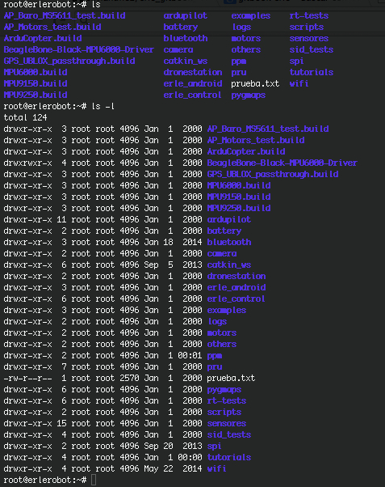

####File system security (access rights)

In your unixstuff directory, type

```
 ls -l (l for long listing!)
 ```

You will see that you now get lots of details about the contents of your directory, similar to the example below:


Each file (and directory) has associated access rights, which may be found by typing ls -l. Also, ls -lg gives additional information as to which group owns the file (beng95 in the following example):
```
-rwxrw-r-- 1 ee51ab beng95 2450 Sept29 11:52 file1
```

In the left-hand column is a 10 symbol string consisting of the symbols d, r, w, x, -, and, occasionally, s or S. If d is present, it will be at the left hand end of the string, and indicates a directory: otherwise - will be the starting symbol of the string.

The 9 remaining symbols indicate the permissions, or access rights, and are taken as three groups of 3.

The left group of 3 gives the file permissions for the user that owns the file (or directory) (ee51ab in the above example);
the middle group gives the permissions for the group of people to whom the file (or directory) belongs (eebeng95 in the above example);
the rightmost group gives the permissions for all others.
The symbols r, w, etc., have slightly different meanings depending on whether they refer to a simple file or to a directory.

*working with erlerobot:*




#####Access rights on files.

r (or -), indicates read permission (or otherwise), that is, the presence or absence of permission to read and copy the file
w (or -), indicates write permission (or otherwise), that is, the permission (or otherwise) to change a file
x (or -), indicates execution permission (or otherwise), that is, the permission to execute a file, where appropriate

#####Access rights on directories.

r allows users to list files in the directory;
w means that users may delete files from the directory or move files into it;
x means the right to access files in the directory. This implies that you may read files in the directory provided you have read permission on the individual files.
So, in order to read a file, you must have execute permission on the directory containing that file, and hence on any directory containing that directory as a subdirectory, and so on, up the tree.

#####Some examples

-rwxrwxrwx

*a file that everyone can read, write and execute (and delete)*

-rw-------

*a file that only the owner can read and write - no-one else
can read or write and no-one has execution rights (e.g. your
mailbox file)*
