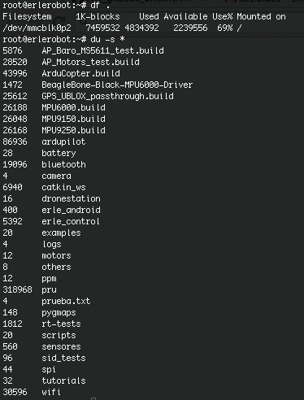
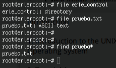

## Other useful Unix commands


####df

The `df` command reports on the space left on the file system. For example, to find out how much space is left on the fileserver, type

```
df .
```

#####du

The `du` command outputs the number of kilobyes used by each subdirectory. If you want to find out which directory has the most files. In your home-directory, type

```
du -s *
```

The -s flag will display only a summary (total size) and the * means all files and directories.

*working with erlerobot:*




#####gzip

This reduces the size of a file, thus freeing valuable disk space. For example, type

```
ls -l science.txt
```

and note the size of the file using `ls -l `. Then to compress science.txt, type

```
gzip science.txt
```

This will compress the file and place it in a file called science.txt.gz

To see the change in size, type` ls -l` again.

To expand the file, use the gunzip command.

```
gunzip science.txt.gz
```

#####zcat

`zcat` will read gzipped files without needing to uncompress them first.

```
zcat science.txt.gz
```

If the text scrolls too fast for you, pipe the output though less .

```
zcat science.txt.gz | less
```

#####file

`file` classifies the named files according to the type of data they contain, for example ascii (text), pictures, compressed data, etc.. To report on all files in your home directory, type

```
file *
```

#####diff

This command compares the contents of two files and displays the differences. Suppose you have a file called file1 and you edit some part of it and save it as file2. To see the differences type

```
diff file1 file2
```

Lines beginning with a < denotes file1, while lines beginning with a > denotes file2.

#####find

This searches through the directories for files and directories with a given name, date, size, or any other attribute you care to specify. It is a simple command but with many options - you can read the manual by typing man find.

To search for all files with the extention .txt, starting at the current directory (.) and working through all sub-directories, then printing the name of the file to the screen, type

```
find . -name "*.txt" -print
```

To find files over 1Mb in size, and display the result as a long listing, type

```
find . -size +1M -ls
```

*working with erlerobot:*




#####history

The C shell keeps an ordered list of all the commands that you have entered. Each command is given a number according to the order it was entered.

```
history (show command history list)
```

If you are using the C shell, you can use the exclamation character (!) to recall commands easily.

```
!! (recall last command)

!-3 (recall third most recent command)

!5 (recall 5th command in list)

!grep (recall last command starting with grep)
 ```


You can increase the size of the history buffer by typing

```
set history=100
```
By using the *navigation keys* on your keyboard (up, down) you can recall the previous commands.

You can also use the *recursive search*. If you type `^R` ([control +R]) and afterward the letter c, the shell shows you the previus commands beginning with c.

##### Shutdown

If you want to turn off a Linux machine, type:
```
shutdown -h now
```
#### bc

 The command `bc` open an arbitrary precision calculator language. To use it type:
 ```
 bc
 (a text should appear on yout screen)
 7*2
 (the result should be 14)
 quit (you get out of the calculator)
 ```
 Another possibility of evaluating this is typing:
 ```
 echo '7*2' | bc -l
 ```

 Also, it can evaluate expressions like `exp1 < exp2 `
returning a 1 if it is true and a 0 if it is false.
For furtherinformation type:
```
man bc
```

