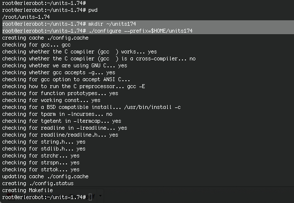

####7.4 Configuring and creating the Makefile

The first thing to do is carefully read the *README* and *INSTALL* text files (use the less command). These contain important information on how to compile and run the software.

The units package uses the GNU configure system to compile the source code. We will need to specify the installation directory, since the default will be the main system area which you will not have write permissions for. We need to create an install directory in your home directory.

```
mkdir ~/units174
```
Note: With this command you create the directory units174 in your home directory, but you don't move to it. Using `pwd`you can check thatyou continue in the directory units-1.74

Then run the configure utility setting the installation path to this.


```
./configure --prefix=$HOME/units174
```

 *working with erlerobot*

 

NOTE: The $HOME variable is an example of an environment variable. The value of $HOME is the path to your home directory. Just type

```
echo $HOME
```


to show the contents of this variable. We will learn more about environment variables in a later chapter.

If configure has run correctly, it will have created a Makefile with all necessary options. You can view the Makefile if you wish (use the less command), but do not edit the contents of this.
