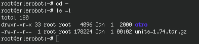

## Extracting the source code

Now, in your home-erle-directory, where you have saved the file, type:

```
ls -l
 ```

*working with erlerobot:*



As you can see, the filename ends in tar.gz. The tar command turns several files and directories into one single tar file. This is then compressed using the gzip command (to create a tar.gz file).

First unzip the file using the gunzip command. This will create a .tar file.

```
gunzip units-1.74.tar.gz
```

Then extract the contents of the tar file.

```
tar -xvf units-1.74.tar
```

Again, list the contents of the download directory, then go to the units-1.74 sub-directory.

```
cd units-1.74
```
