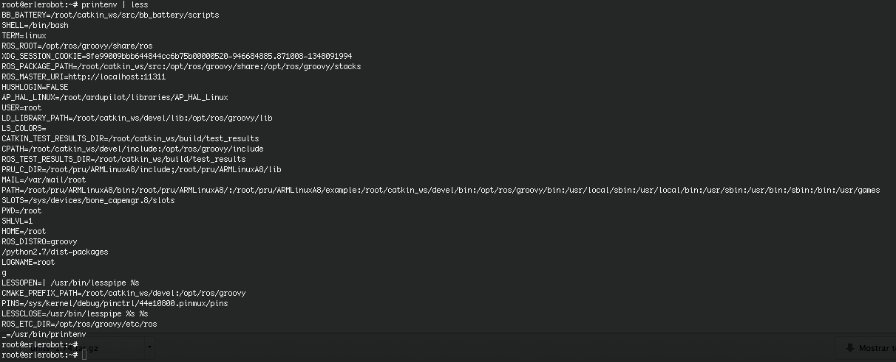
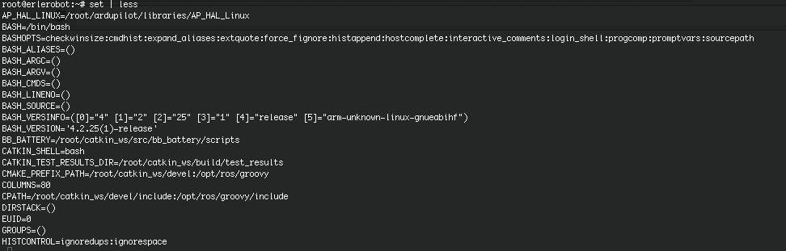

# Tutorial 8
---
####8.1 UNIX Variables

Variables are a way of passing information from the shell to programs when you run them. Programs look "in the environment" for particular variables and if they are found will use the values stored. Some are set by the system, others by you, yet others by the shell, or any program that loads another program.

Standard UNIX variables are split into two categories, environment variables and shell variables. In broad terms, shell variables apply only to the current instance of the shell and are used to set short-term working conditions; environment variables have a farther reaching significance, and those set at login are valid for the duration of the session. By convention, environment variables have UPPER CASE and shell variables have lower case names.


####8.2 Environment Variables

An example of an environment variable is the OSTYPE variable. The value of this is the current operating system you are using. Type

```
echo $OSTYPE
```

More examples of environment variables are

| **Variable** | **Meaning** |
|---------------|---------------|
|USER |your login name|
|HOME |the path name of your home directory|
|HOST| the name of the computer you are using|
|ARCH |the architecture of the computers processor|
|DISPLAY |the name of the computer screen to display X windows|
|PRINTER |the default printer to send print jobs|
|PATH |the directories the shell should search to find a command|
|OSTYPE|The value of this is the current operating system you are using|

Finding out the current values of these variables.

ENVIRONMENT variables are set using the `setenv` command, displayed using the `printenv` or `env` commands, and unset using the `unsetenv` command.

To show all values of these variables, type

```
printenv | less
```

*working with erlerobot:*




####8.3 Shell Variables

An example of a shell variable is the history variable. The value of this is how many shell commands to save, allow the user to scroll back through all the commands they have previously entered. Type

```
echo $history
```

More examples of shell variables are

| **Variable** | **Meaning** |
|---------------|---------------|
|cwd |your current working directory|
|home |the path name of your home directory|
|path |the directories the shell should search to find a command|
|prompt| the text string used to prompt for interactive commands shell your login shell|

Finding out the current values of these variables.

SHELL variables are both set and displayed using the `set `command. They can be unset by using the `unset` command.

To show all values of these variables, type

```
set | less
```
*working with erlerobot:*



*So what is the difference between PATH and path ?*

In general, environment and shell variables that have the same name (apart from the case) are distinct and independent, except for possibly having the same initial values. There are, however, exceptions.

Each time the shell variables home, user and term are changed, the corresponding environment variables HOME, USER and TERM receive the same values. However, altering the environment variables has no effect on the corresponding shell variables.

PATH and path specify directories to search for commands and programs. Both variables always represent the same directory list, and altering either automatically causes the other to be changed.

####8.4 Using and setting variables

Each time you login to a UNIX host, the system looks in your home directory for initialisation files. Information in these files is used to set up your working environment. The C and TC shells uses two files called *.login* and *.cshrc* (note that both file names begin with a dot).

At login the C shell first reads *.cshrc* followed by *.login*

*.login* is to set conditions which will apply to the whole session and to perform actions that are relevant only at login.

*.cshrc* is used to set conditions and perform actions specific to the shell and to each invocation of it.

The guidelines are to set ENVIRONMENT variables in the *.login* file and SHELL variables in the *.cshrc* file.

WARNING: NEVER put commands that run graphical displays (e.g. a web browser) in your *.cshrc* or *.login* file.

####8.5 Setting shell variables in the .cshrc file

For example, to change the number of shell commands saved in the history list, you need to set the shell variable history. It is set to 100 by default, but you can increase this if you wish.

```
 set history = 200
 ```

Check this has worked by typing

```
echo $history
```

However, this has only set the variable for the lifetime of the current shell. If you open a new xterm window, it will only have the default history value set. To PERMANENTLY set the value of history, you will need to add the set command to the *.cshrc* file.

First open the *.cshrc* file in a text editor. An easy, user-friendly editor to use is nedit.

```
nedit ~/.cshrc
```
Or if you don't have it installes you can use vi text editor.
```
vi  ~/.cshrc
```
Add the following line AFTER the list of other commands.
```
set history = 200

```
If you are using [vi](http://www.radford.edu/~mhtay/CPSC120/VIM_Editor_Commands.htm):
```
set history = 200
<ESC> (for going to the command mode)
:w (for saving)
:q (for exit the programm)
```

Save the file and force the shell to reread its *.cshrc* file buy using the shell source command.

```
source .cshrc
```

Check this has worked by typing

```
echo $history
```

####8.6 Setting the path

When you type a command, your path (or PATH) variable defines in which directories the shell will look to find the command you typed. If the system returns a message saying "command: Command not found", this indicates that either the command doesn't exist at all on the system or it is simply not in your path.

For example, to run units, you either need to directly specify the units path (~/units174/bin/units), or you need to have the directory ~/units174/bin in your path.

You can add it to the end of your existing path (the $path represents this) by issuing the command:

```
set path = ($path ~/units174/bin)
```

Test that this worked by trying to run units in any directory other that where units is actually located.

```
cd
units
```

To add this path PERMANENTLY, add the following line to your *.cshrc* AFTER the list of other commands.

```
set path = ($path ~/units174/bin)
```
####Summary

######ENVIRONMENT variables

| **Variable** | **Meaning** |
|---------------|---------------|
|USER |your login name|
|HOME |the path name of your home directory|
|HOST| the name of the computer you are using|
|ARCH |the architecture of the computers processor|
|DISPLAY |the name of the computer screen to display X windows|
|PRINTER |the default printer to send print jobs|
|PATH |the directories the shell should search to find a command|
|OSTYPE|The value of this is the current operating system you are using|

######Shell variables

| **Variable** | **Meaning** |
|---------------|---------------|
|cwd |your current working directory|
|home |the path name of your home directory|
|path |the directories the shell should search to find a command|
|prompt| the text string used to prompt for interactive commands shell your login shell|

######Other commands


|**Command**|	**Meaning**|
|-----------|--------------|
|printenv *pipe* less|show all values of environmment variables|
|set *pipe* less|show all values of shell variables|


