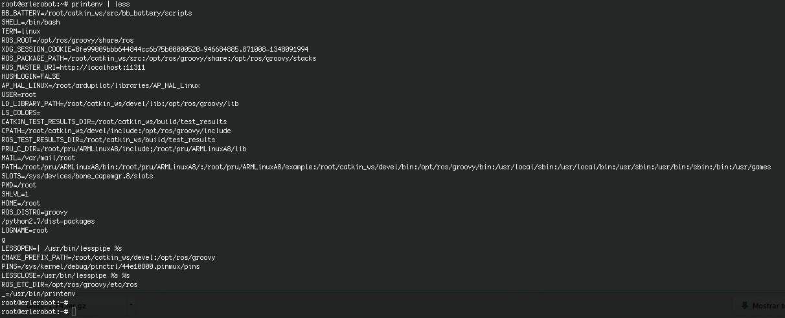

## Environment Variables

An example of an environment variable is the OSTYPE variable. The value of this is the current operating system you are using. Type

```
echo $OSTYPE
```

More examples of environment variables are

| **Variable** | **Meaning** |
|---------------|---------------|
|USER |your login name|
|HOME |the path name of your home directory|
|HOST| the name of the computer you are using|
|ARCH |the architecture of the computers processor|
|DISPLAY |the name of the computer screen to display X windows|
|PRINTER |the default printer to send print jobs|
|PATH |the directories the shell should search to find a command|
|OSTYPE|The value of this is the current operating system you are using|

Finding out the current values of these variables.

ENVIRONMENT variables are set using the `setenv` command, displayed using the `printenv` or `env` commands, and unset using the `unsetenv` command.

To show all values of these variables, type

```
printenv | less
```

*working with erlerobot:*




