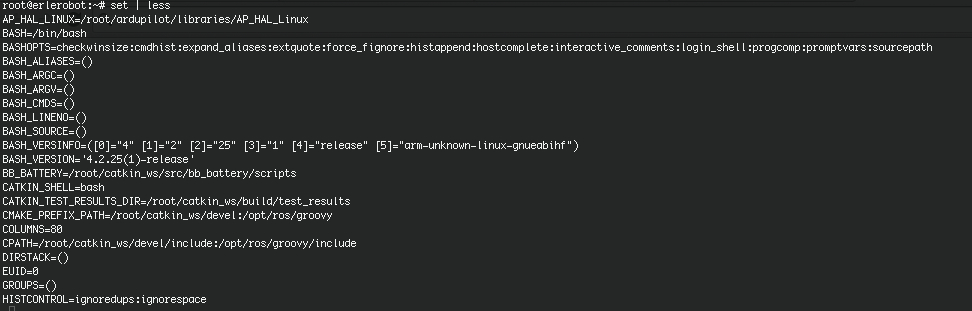

##Shell Variables

An example of a shell variable is the history variable. The value of this is how many shell commands to save, allow the user to scroll back through all the commands they have previously entered. Type

```
echo $history
```

More examples of shell variables are

| **Variable** | **Meaning** |
|---------------|---------------|
|cwd |your current working directory|
|home |the path name of your home directory|
|path |the directories the shell should search to find a command|
|prompt| the text string used to prompt for interactive commands shell your login shell|

Finding out the current values of these variables.

SHELL variables are both set and displayed using the `set `command. They can be unset by using the `unset` command.

To show all values of these variables, type

```
set | less
```
*working with erlerobot:*



*So what is the difference between PATH and path ?*

In general, environment and shell variables that have the same name (apart from the case) are distinct and independent, except for possibly having the same initial values. There are, however, exceptions.

Each time the shell variables home, user and term are changed, the corresponding environment variables HOME, USER and TERM receive the same values. However, altering the environment variables has no effect on the corresponding shell variables.

PATH and path specify directories to search for commands and programs. Both variables always represent the same directory list, and altering either automatically causes the other to be changed.
