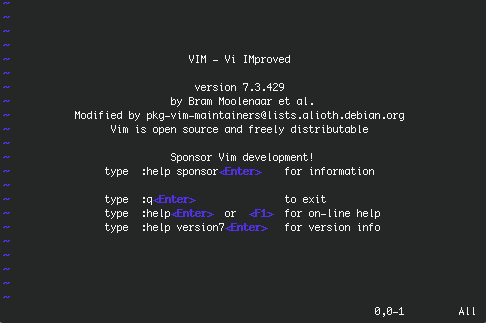

# Tutorial 9
---

#### 9.1 What is *vi* ?

*vi* is a screen-oriented text editor originally created for the Unix  operating system.
*vi* was designed for editing standard format file and nowadays can be use in a wide variety of sistems and terminals. One of the strong points of *vi* is its adaptability.
For Linux, exits a improved text editor called *vim*. One of the advantages of *vim* is the ability to undo receding one by one the latest changes.*Vim* also allows highlighting the certain files  syntax such as  .shellscript, html, C language, and other
many languages. These and other details make it very suitable for programming.
*Erlerobot* uses vim. You can find out this by typing:
```
vi
```

*working with erlerobot:*




####9.2 Essential commands
