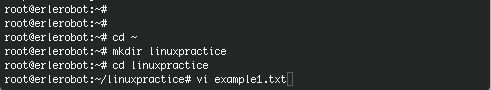
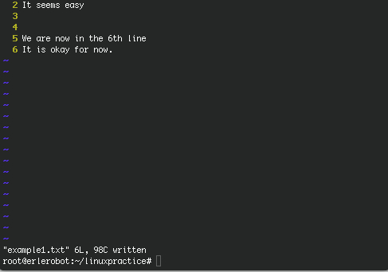
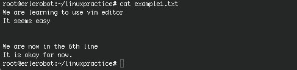
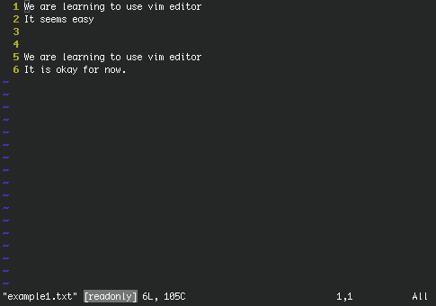
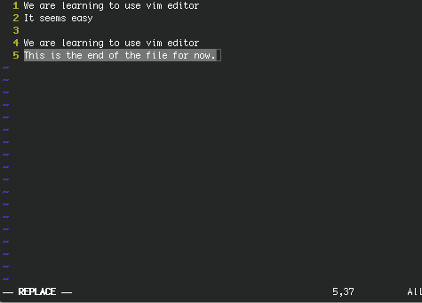

# Tutorial 9
---

#### 9.1 What is *vi* ?

*vi* is a screen-oriented text editor originally created for the Unix  operating system.
*vi* was designed for editing standard format file and nowadays can be use in a wide variety of sistems and terminals. One of the strong points of *vi* is its adaptability.
For Linux, exits a improved text editor called *vim*. One of the advantages of *vim* is the ability to undo receding one by one the latest changes.*Vim* also allows highlighting the certain files  syntax such as  .shellscript, html, C language, and other
many languages. These and other details make it very suitable for programming.
*Erlerobot* uses vim. You can find out this by typing:
```
vi
```

*working with erlerobot:*


####9.2 Essential commands

Below are three tables containing the more usual *vim* commands. If you have more interest in *vim* commands or you are looking for other different commands, [here ](http://www.cs.rit.edu/~cslab/vi.html) you can find a more complete documentation.

#####Command line

| **Command** | **Meaning** |
|---------------|---------------|
|vi | edit a new file |
|vi file| edit a existing file|
|vi -r file| Edit recovering the changes not saved|
|vi file1 file2 ...|edit various files successively|

#####Command mode

You get to command mode from the *entry mode* ("writing mode") by typing *Esc*.

| **Command** | **Meaning** |
|---------------|---------------|
|h | previous character|
|j or *enter* | next line|
|k|previous line|
|l or *space* | next character|
|L| last line|
|H| first line|
|M| central line|
|i | text entry - inserting|
|R| text entry - replacing |
|u| undo last modification|
|^R| undo the las *u* command|
|/ |Search a characters string|
|dd| remove a line|
|yy| save lines in the buffer|
|p|copy a buffer line, after the actual one|
|^G| show the name of the file, the number of lines, and the actual line|
|.|repeat last command
|ZZ| end saving the changes|

####Ex mode

You get to ex mode from the command mode by typing *:*.

| **Command** | **Meaning** |
|---------------|---------------|
|:*num*| position the cursor in the line *num* |
|:w | save|
|:w! | save forcing|
|:x| leave saving if necessary |
|:q|leave if there is no modification|
|:q!|leave without saving|
|:wq| leave saving changes|
|:set nu | number the lines|
|:set showmode|show the mode|
|:e file| edit simultaneously another file|
|:e #|Come back to the previous file|


#### 9.3 Practical introduction to *vim*

We are going to familiarize with the *vim* text editor by doing some practical examples.For now on, we are *working with erlerobot*.

First, go to erle home and create a directory, called *linuxpractice*, where we are going to save the files.
Create and open with *vim* a .txt file, using `vi`.



We are going to number the lines and show the mode we are working on, type :
```
: (press enter)
(you are in the ex mode)
:set showmode (press enter)
:set nu (press enter)
```
Press `i ` and type what you want. Remember: press *enter* to continue writing in the next line. When you finish typing press *escape* and ZZ for save and leave.



If you type
```
cat example1.txt
```
You can see what you have written in the file:




Open again the file by typing:
```
vi example1.txt
```
After opening it:
```
:(press enter)
:set nu (press enter)
:set showmode(press enter)
```

*Question:*  What should be the result of doing...?
```
:5 (press enter)
dd
```


*Question:*  What should be the result of doing...?
```
:1(press enter)
yy
:4
p
```


Leave and save using
```
:(press enter)
:wq (press enter)
```

Now we are going to remove the *wrining permissions*. This means that *example1.txt* should be a *readonly* file.
```
chmod 444 example1.txt
```
If you open the file with `vi` ,you will find a warn message at the end of the file:



Type
```
:(press enter)
:3 (press enter)
dd (press escape)
:5 (press enter)
R
This is the end of the file for now.
```
The aspect of the file is:



If you try to save and leave using:
```
(press escape)
ZZ
```
you get this message:
```
E45: 'readonly' option is set (add ! to override)
```
You can overwrite the file and save the changes forcing:
```
(press escape)
:w!
```

**Exercise:**

Create a file in *linuxpractice* directory and call it erle_description.txt
Write a short description of erlerobot (3 lines).
After that leave two blank lines and write your name.
Save the changes and leave.

If you do `cat`the result should be something like this:


Now try to delete the line 4 and to write your name in the first line.
The final result is the following one:


