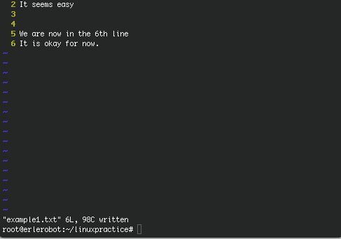
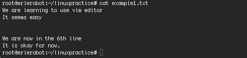
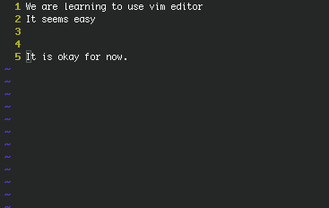
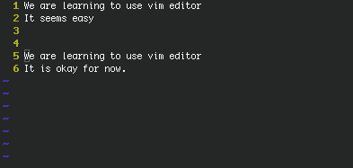
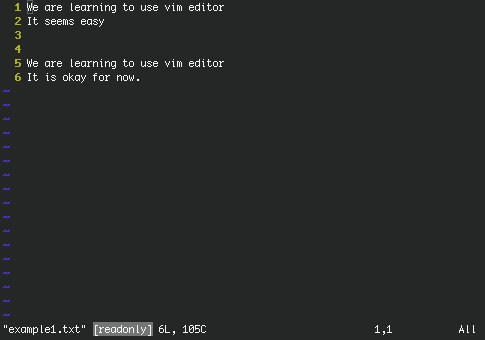
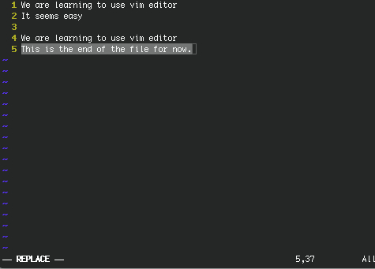
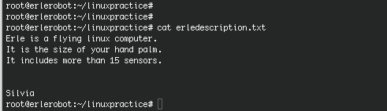
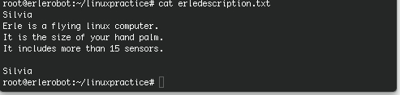

## Practical introduction to *vim*

We are going to familiarize with the *vim* text editor by doing some practical examples.For now on, we are *working with erlerobot*.

First, go to erle home and create a directory, called *linuxpractice*, where we are going to save the files.
Create and open with *vim* a .txt file, using `vi`.


We are going to number the lines and show the mode we are working on, type :
```
: (press enter)
(you are in the ex mode)
:set showmode (press enter)
:set nu (press enter)
```
Press `i ` and type what you want. Remember: press *enter* to continue writing in the next line. When you finish typing press *escape* and ZZ for save and leave.



If you type
```
cat example1.txt
```
You can see what you have written in the file:




Open again the file by typing:
```
vi example1.txt
```
After opening it:
```
:(press enter)
:set nu (press enter)
:set showmode(press enter)
```

*Question:*  What should be the result of doing...?
```
:5 (press enter)
dd
```



*Question:*  What should be the result of doing...?
```
:1(press enter)
yy
:4
p
```



Leave and save using
```
:(press enter)
:wq (press enter)
```

Now we are going to remove the *wrining permissions*. This means that *example1.txt* should be a *readonly* file.
```
chmod 444 example1.txt
```
If you open the file with `vi` ,you will find a warn message at the end of the file:



Type
```
:(press enter)
:3 (press enter)
dd (press escape)
:5 (press enter)
R
This is the end of the file for now.
```
The aspect of the file is:



If you try to save and leave using:
```
(press escape)
ZZ
```
you get this message:
```
E45: 'readonly' option is set (add ! to override)
```
You can overwrite the file and save the changes forcing:
```
(press escape)
:w!
```

**Exercise:**

Create a file in *linuxpractice* directory and call it erle_description.txt
Write a short description of erlerobot (3 lines).
After that leave two blank lines and write your name.
Save the changes and leave.

If you do `cat`the result should be something like this:



Now try to delete the line 4 and to write your name in the first line.
The final result is the following one:




